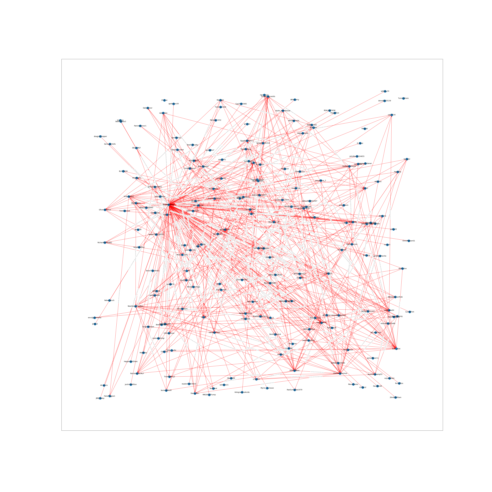

## Measuring The Propagation Speed Of Information Spread In Social Networks For Real-Time Fake News Detection
 

### Requirements:
-----------------
**1. Data Collection** (to be reimplemented in Kotlin)                   
**2. Data Wrangling & Preprocessing** - Spark and Kotlin      
**3. Graph Creation & Crud In Cypher**- Cypher and Kotlin  
**4. Graph Algorithms**               - Cypher and Spark GraphFrames and Kotlin 

### 1. Data Collection
----------------------
- **thesis-crawler** contains an akka based crawler, that generates our dataset.

More specifically, the program comprises of three actor:  
1. **StreamListenerActor** - monitors a list of sources that have been characterized as sources that generate fake news
More information can be found on this link: https://arxiv.org/pdf/1707.07592.pdf
2. **RetweetHandlerActor** - when the StreamListenerActor receives retweets, RetweetHandlerActor fetches the 100 most recent posts for that tweet.
3. **SampleStreamListenerActor** - Monitors the twitter live stream and fetches all the incoming data.

Running the crawler for almost a week generates about 35GB of data, from the live stream as well as from the sources that are marked as Fake News Generators
### 2. Preprocessing (ETL-Pipeline)
----------------------------------
- **thesis-etl** contains the preprocessing pipeline.

Our pipeline includes the following steps:
1. First we load all the data collected from the data collection layer
2. We separate our data into three categories - Tweets, Retweets, Replies and we remove duplicates that might exists
3. We do some analysis on our data in order to keep:
    - only those tweets for which we have retweets
    - only those retweets for which we have the original tweet post
    - only those replies for which we have the original tweet post
4. In order to minimize the size of our data, we keep only the fields that are of interest:
    - For the <a name="tweet">tweets</a> we keep the fields - **created_at** , **id, in_reply_to_screen_name**, **in_reply_to_status_id**, **in_reply_to_user_id**, **retweeted_status**, **text**, **user**
    - For the <a name="retweets">retweets</a> we keep the fields - **created_at**, **id**, **retweeted_status**, **text**, **user**
    - For the <a name="replies">replies</a> we keep the fields - **created_at**, **id**, **in_reply_to_screen_name**, **in_reply_to_status_id**, **in_reply_to_user_id**, **text**, **user**
 Some of those fields, like retweeted_status and user contain nested fields which get flattened as part of the process
5. Then from the tweets we gather, we extract the unique usernames
6. For every user that we have we retrieve a list with all of their followers
7. When the preprocessing pipeline finishes, all the data gets stored on the filesystem for now.

### 3. Graph Builder
--------------------
- **thesis-graph** contains the graph database generator.

The Graph Builder is a suite of methods that:
1. Receives preprocessed data modeled appropriately.
2. Creates appropriate constraints and indexes for the graph database.
3. Inserts the data in the database using the correct format, ex:
    - Users are inserted as Nodes
    - Tweets are inserted as Nodes
    - The relationship that states a User posted a Tweet is inserted as an Edge connecting the two Nodes.
4. The data is being persisted in the Graph Database allowing someone to run algorithms on the Graph Model.

When a [tweet](#tweet) is parsed, we are fetching details about it like the User posting the tweet, retweets, replies etc.

Parsed tweets are inserted into the Graph Database along with information regarding the user posted the tweet, tweet id, text of the tweet. We extract information about a user and create a User Node with details about his screen_name and id. Then, we connect the User Node and the Tweet Node with a **:TWEETED** relationship. 

We hold information about [retweets](#retweets) of tweets and [replies](#replies) to tweets. All the retweets and replies for a specific tweet are ordered by their created_at attribute. Then, we insert them into the Graph Database resulting in a chain of retweets and replies, all ordered by their created_at attribute, pointing to the original tweet. They are connected with each other with edges tagged as **:RETWEETED_FROM** and **:REPLIED_TO**.

We, also, depict the relationship a user following another user with an edge tagged **:FOLLOWS** connecting two nodes, and an arrow pointing to the followed user node. 

##### Example image of a network graph, showing the propagation of a tweet story.

### 4. Graph Algorithms
-----------------------   
* TODO: Description about the graph algorithms

### TODO:
---------
1. Add logging instead to all the projects
2. Extract variables to configuration and load the from there
3. Add graph algorithms
4. Add Testing
5. Containerize the project and add bash scripts
6. Add CI/CD
